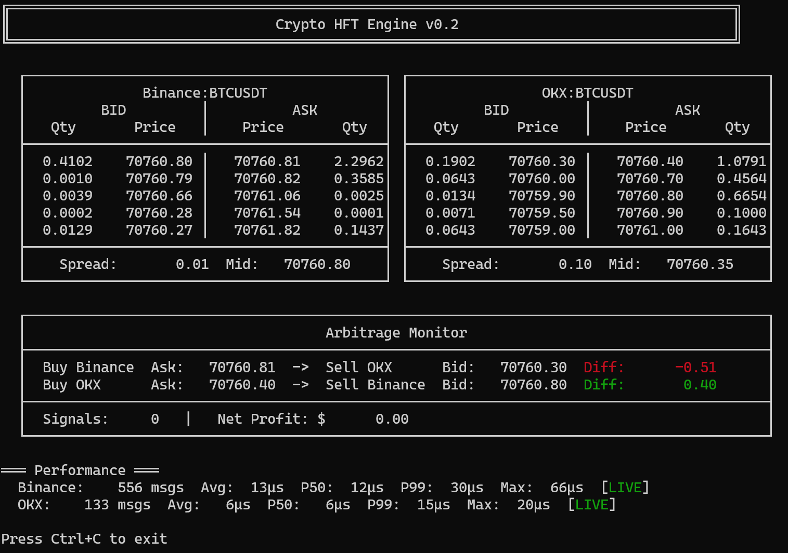
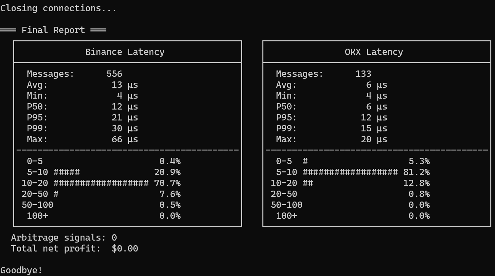
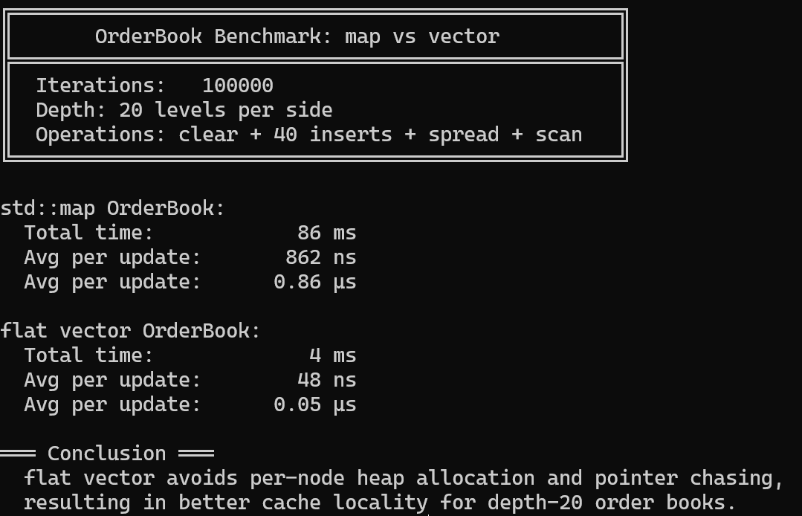

# Crypto HFT Engine

A low-latency, cross-exchange cryptocurrency arbitrage monitoring system built in C++17. Connects to multiple exchanges via WebSocket, maintains real-time order books, and detects arbitrage opportunities across exchanges.

## Screenshot

### Live Dashboard


### Final Report


### Orderbook Benchmark


## Architecture

```
                    ┌──────────────────────────────────────┐
                    │             Main Thread              │
                    │  Display + Arbitrage Detection Loop  │
                    └──────────┬───────────┬───────────────┘
                               │           │
                    ┌──────────▼──┐  ┌─────▼─────────┐
                    │   Thread 1  │  │    Thread 2   │
                    │  Binance WS │  │     OKX WS    │
                    └──────┬──────┘  └──────┬────────┘
                           │                │
                    ┌──────▼──────┐  ┌──────▼─────────┐
                    │  OrderBook  │  │   OrderBook    │
                    │  (Binance)  │  │     (OKX)      │
                    └──────┬──────┘  └──────┬─────────┘
                           │                │
                    ┌──────▼────────────────▼──────────┐
                    │      ArbitrageDetector           │
                    │  Cross-exchange spread analysis  │
                    │  Fee-adjusted profit calculation │
                    └──────────────────────────────────┘
```

## Features

- **Real-time dual exchange data**: Simultaneous WebSocket connections to Binance and OKX
- **Multi-threaded architecture**: Each exchange runs on an independent thread with mutex-protected shared state
- **Order book maintenance**: Cache-friendly flat vector order book with 18x faster updates than std::map
- **Cross-exchange arbitrage detection**: Bi-directional spread monitoring with configurable fee rates and signal deduplication
- **Low-latency JSON parsing**: Uses simdjson for microsecond-level message processing (avg 10-15us)
- **Live terminal dashboard**: Side-by-side order book display with colored arbitrage signals
- **Latency profiling**: p50/p95/p99 latency tracking with histogram visualization
- **Signal logging**: File-based logging with timestamps for spread snapshots and arbitrage signals
- **JSON configuration**: Trading pairs, fee rates, and display settings configurable via config.json

## Tech Stack

| Component | Technology |
|-----------|-----------|
| Language | C++17 |
| Build System | CMake |
| WebSocket | Boost.Beast |
| SSL/TLS | OpenSSL |
| JSON Parser | simdjson |
| Threading | std::thread + std::mutex |
| Timing | std::chrono (high_resolution_clock) |

## Project Structure

```
Crypto_HFT_Engine/
├── CMakeLists.txt
├── config.json                       # Runtime configuration
├── setup.sh
├── include/
│   ├── orderbook.h                   # Flat vector order book
│   ├── market_data_feed.h            # WebSocket connection + JSON parsing
│   ├── arbitrage_detector.h          # Cross-exchange spread detection
│   ├── latency_tracker.h             # p50/p95/p99 latency profiling
│   ├── display.h                     # Terminal UI rendering
│   ├── logger.h                      # File-based signal/spread logging
│   └── config.h                      # JSON config reader
├── src/
│   └── main.cpp                      # Entry point, thread management, main loop
├── benchmark/
│   └── orderbook_benchmark.cpp       # map vs vector performance comparison
├── docs/
│   ├── screenshot_dashboard.png
│   └── screenshot_report.png
└── third_party/
    ├── simdjson.h
    └── simdjson.cpp
```

## How It Works

1. **Configuration**: On startup, reads config.json for exchange endpoints, fee rates, and display settings. Falls back to defaults if config is missing.

2. **Market Data Ingestion**: Two independent threads connect to Binance and OKX WebSocket APIs, receiving depth-20 order book snapshots every 100ms.

3. **Order Book Update**: Each snapshot is parsed using simdjson and written into a flat vector order book. Bids are stored high-to-low, asks low-to-high, matching exchange sort order for zero-copy insertion.

4. **Arbitrage Detection**: The main thread reads both order books every 200ms and compares both directions. A signal is generated only when the price difference exceeds the round-trip fee (default 0.1% per side) and the price has changed since the last signal (deduplication).

5. **Logging**: All signals are written to timestamped log files. Spread snapshots are recorded every 10 seconds for post-session analysis.

6. **Display**: All data is rendered to the terminal in a dashboard layout with ANSI color coding.

## Quick Start

### Prerequisites
- Ubuntu 22.04+ or WSL2
- g++ with C++17 support
- CMake 3.16+

### Build & Run

```bash
# Install dependencies
chmod +x setup.sh
./setup.sh

# Build
mkdir build && cd build
cmake ..
make

# Run (from project root, so config.json and logs/ are in the right place)
cd ..
./build/crypto_hft_engine
```

### Configuration

Edit `config.json` to change trading pairs, fee rates, or display settings:

```json
{
    "binance": { "symbol": "ETHUSDT", "path": "/ws/ethusdt@depth20@100ms" },
    "arbitrage": { "fee_rate": 0.001, "min_profit": 0.01 },
    "display": { "refresh_ms": 200, "levels": 5 }
}
```

## Performance

| Metric | Value |
|--------|-------|
| Order book update (std::map) | 862 ns |
| Order book update (flat vector) | 48 ns |
| **Improvement** | **18x** |
| Binance parse latency (p50) | ~15 us |
| OKX parse latency (p50) | ~8 us |
| Parse latency (p99) | < 100 us |
| Best bid/ask query | O(1) array index |
| Memory footprint | < 10 MB |

### Benchmark

```bash
# Build and run the order book benchmark
g++ -std=c++17 -O2 -o benchmark/orderbook_bench benchmark/orderbook_benchmark.cpp
./benchmark/orderbook_bench
```

## Design Decisions

**Why flat vector instead of std::map for the order book?**
The initial implementation used `std::map` (red-black tree) for automatic sorting. Profiling revealed that per-node heap allocation and pointer chasing caused significant cache misses. Since exchange depth snapshots arrive pre-sorted, a flat `std::vector<PriceLevel>` with direct append achieves the same result with zero heap allocation and 100% cache hit rate. Benchmarking showed an **18x improvement** (862ns to 48ns per update) over 100K iterations.

**Why synchronous WebSocket reads?**
Each exchange connection is isolated in its own thread with blocking reads. The bottleneck is network I/O (milliseconds), not thread synchronization (nanoseconds), so async I/O would add complexity without meaningful latency improvement.

**Why std::mutex instead of lock-free?**
Mutex contention is negligible compared to network latency. Premature lock-free optimization would increase code complexity and bug surface without measurable benefit at current throughput levels.

**Why signal deduplication?**
Without deduplication, the same arbitrage opportunity triggers repeatedly every 200ms while the price remains unchanged. Each direction tracks its last buy/sell price independently and only fires when the price has moved.

## Roadmap

- [x] Dual exchange WebSocket data (Binance + OKX)
- [x] Cross-exchange arbitrage detection
- [x] Latency histogram (p50/p95/p99)
- [x] Signal logging to file
- [x] Flat vector order book optimization (18x faster)
- [x] JSON configuration
- [ ] Add Bybit exchange support
- [ ] Lock-free SPSC queue for order book updates
- [ ] Custom memory pool allocator
- [ ] SIMD-optimized price comparison

## License

MIT License - see [LICENSE](LICENSE) for details.