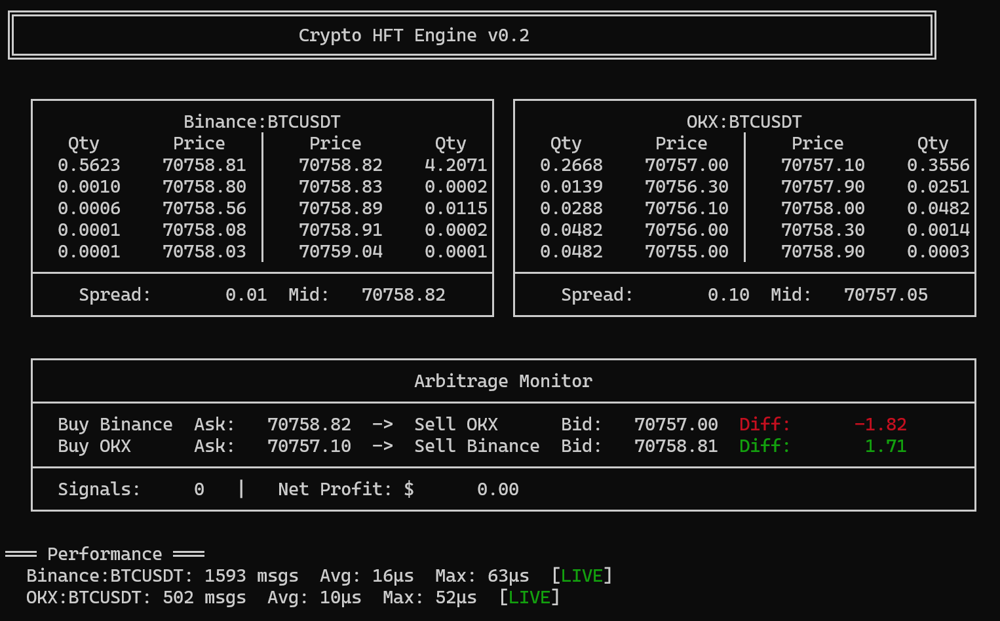

# Crypto HFT Engine

A low-latency, cross-exchange cryptocurrency arbitrage monitoring system built in C++17. Connects to multiple exchanges via WebSocket, maintains real-time order books, and detects arbitrage opportunities across exchanges.

## Screenshot


## Architecture

```
                    ┌──────────────────────────────────────┐
                    │             Main Thread              │
                    │  Display + Arbitrage Detection Loop  │
                    └──────────┬───────────┬───────────────┘
                               │           │
                    ┌──────────▼──┐  ┌─────▼──────────┐
                    │   Thread 1  │  │    Thread 2    │
                    │  Binance WS │  │     OKX WS     │
                    └──────┬──────┘  └──────┬─────────┘
                           │                │
                    ┌──────▼──────┐  ┌──────▼──────────┐
                    │  OrderBook  │  │    OrderBook    │
                    │  (Binance)  │  │     (OKX)       │
                    └──────┬──────┘  └──────┬──────────┘
                           │                │
                    ┌──────▼────────────────▼──────────┐
                    │      ArbitrageDetector           │
                    │  Cross-exchange spread analysis  │
                    │  Fee-adjusted profit calculation │
                    └──────────────────────────────────┘
```

## Features

- **Real-time dual exchange data**: Simultaneous WebSocket connections to Binance and OKX
- **Multi-threaded architecture**: Each exchange runs on an independent thread with mutex-protected shared state
- **Order book maintenance**: Full depth-20 order book reconstruction from exchange snapshots
- **Cross-exchange arbitrage detection**: Bi-directional spread monitoring with configurable fee rates
- **Low-latency JSON parsing**: Uses simdjson for microsecond-level message processing (avg 10-15μs)
- **Live terminal dashboard**: Side-by-side order book display with colored arbitrage signals

## Tech Stack

| Component | Technology |
|-----------|-----------|
| Language | C++17 |
| Build System | CMake |
| WebSocket | Boost.Beast |
| SSL/TLS | OpenSSL |
| JSON Parser | simdjson |
| Threading | std::thread + std::mutex |
| Timing | std::chrono (high_resolution_clock) |

## Project Structure

```
Crypto_HFT_Engine/
├── CMakeLists.txt
├── setup.sh
├── include/
│   ├── orderbook.h                   # Order book data structure (std::map based)
│   ├── market_data_feed.h            # WebSocket connection + JSON parsing
│   ├── arbitrage_detector.h          # Cross-exchange spread detection
│   └── display.h                     # Terminal UI rendering
├── src/
│   └── main.cpp                      # Entry point, thread management, main loop
└── third_party/
    ├── simdjson.h
    └── simdjson.cpp
```

## How It Works

1. **Market Data Ingestion**: Two independent threads connect to Binance and OKX WebSocket APIs, receiving depth-20 order book snapshots every 100ms.

2. **Order Book Update**: Each snapshot is parsed using simdjson and used to rebuild the local order book. Bids are stored in a `std::map` sorted by price descending, asks sorted ascending.

3. **Arbitrage Detection**: The main thread reads both order books every 200ms and compares:
   - Binance best ask vs OKX best bid (buy Binance, sell OKX)
   - OKX best ask vs Binance best bid (buy OKX, sell Binance)
   
   A signal is generated only when the price difference exceeds the round-trip fee (default 0.1% per side).

4. **Display**: All data is rendered to the terminal in a dashboard layout with ANSI color coding for positive (green) and negative (red) spreads.

## Quick Start

### Prerequisites
- Ubuntu 22.04+ or WSL2
- g++ with C++17 support
- CMake 3.16+

### Build & Run

```bash
# Install dependencies
chmod +x setup.sh
./setup.sh

# Build
mkdir build && cd build
cmake ..
make

# Run
./crypto_hft_engine
```

## Performance

| Metric | Value |
|--------|-------|
| Binance parse latency (avg) | ~15 μs |
| OKX parse latency (avg) | ~10 μs |
| Parse latency (max) | < 100 μs |
| Order book update | O(n log n) per snapshot |
| Best bid/ask query | O(1) via map iterator |
| Memory footprint | < 10 MB |

## Design Decisions

**Why `std::map` for the order book?**  
Maps provide O(log n) insert/delete and O(1) access to min/max via `begin()`/`rbegin()`. For a 20-level order book, constant factors matter more than asymptotic complexity. Future optimization could replace this with a flat sorted array for better cache locality.

**Why synchronous WebSocket reads?**  
Each exchange connection is isolated in its own thread with blocking reads. This keeps the code simple and debuggable. The bottleneck is network I/O (milliseconds), not thread synchronization (nanoseconds), so async I/O would add complexity without meaningful latency improvement.

**Why `std::mutex` instead of lock-free?**  
Mutex contention is negligible compared to network latency. Premature lock-free optimization would increase code complexity and bug surface without measurable benefit at current throughput levels.

## Roadmap

- [ ] Latency histogram (p50/p95/p99)
- [ ] Signal logging to file
- [ ] Add Bybit exchange support
- [ ] Custom memory pool allocator
- [ ] Lock-free SPSC queue for order book updates
- [ ] SIMD-optimized price comparison
- [ ] Configurable trading pairs via JSON config

## License

MIT License - see [LICENSE](LICENSE) for details.
